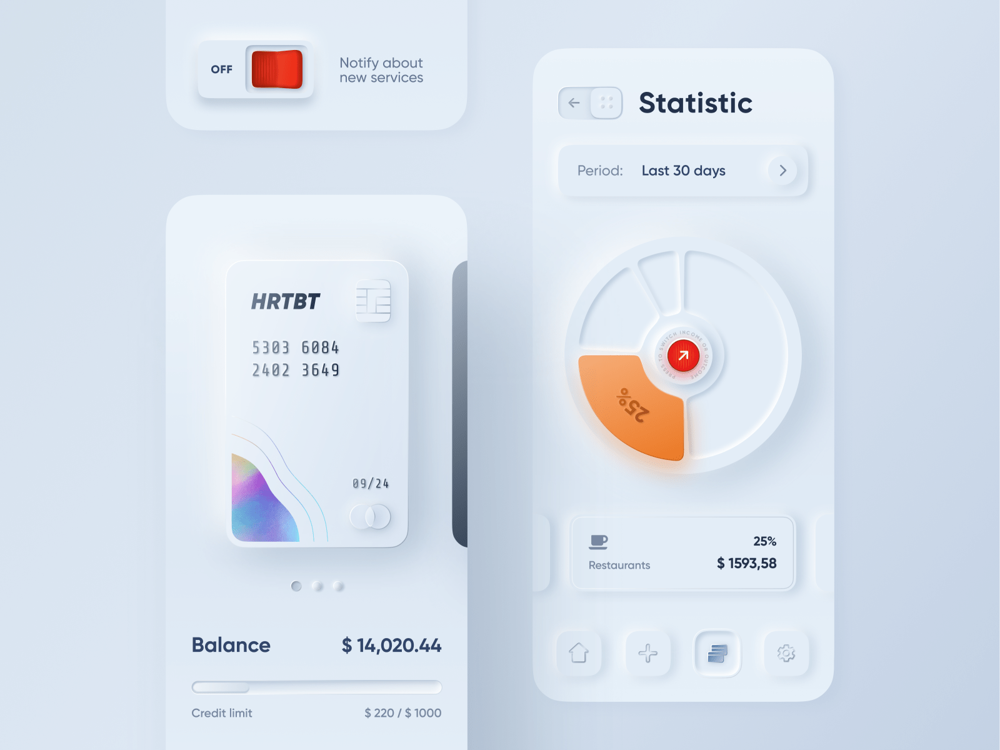
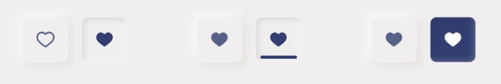
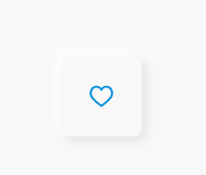
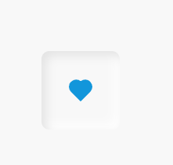

### Neumorphism UI 设计风格

> * 应读为 nu'mofizem，是一种UI设计风格；
> * 也称`solt ui`，风格清新、性冷淡、比较小众、适合小范围使用；



##### Trend趋势

* `Neumorphism`最初是在**Dribble**上流行起来，并引起大量关注；
* 我们知道，由于扁平化风格的流行，拟物化渐渐淡出人们的视野，但不意味着它完全消失；
* 相反，在一些特定场景还是能看到拟物化的设计，苹果在IOS13上就回归了一些拟物化的设计，效果还不错；
* 而因此，`Neumorphism`这种风格就突然间流行起来；

##### 风格

* `Neumorphism`从现实中讲，更像是从一个塑料纸从下往上挤出效果，而不是漂浮在物体表面或是简单的突出；
* 这便是它与`Material`风格不同之处，并且，`Neumorphism`本身颜色应与背景大致一致（或是完全一致）；
* 它通过模拟“挤出”“突出“，并结合光照效果，呈现一个清新的、新鲜的自然状态；

##### 设计实现

* 通常地，由代码来实现这种风格，一般会用一个白色+黑色的阴影来实现，这意味着你的底色不能全是白色或黑色（最起码要带点颜色）

```scss
    .father-1 {
      $c-bg: #efffff;
      background-color: $c-bg;
      .item {
        background-color: $c-bg;
        box-shadow: -6px -6px 12px #ffffff50, 6px 6px 12px #D1CDC750;
      }
    }
```


##### 优点缺点分析

* 前面我们分析了很多关于这种UI风格的优点（比较在短时间能带来清新的体验）
* 但它的缺点也很明显，主要是：可用性（可见性），和编程效率性
* **可见性**
* 如上所见，一个`Neumorphism`风格的按钮（图片）的背景色将与父背景色相同（相融），虽然有一个阴影在
* 但总体的感观没有很显示，与`Material`风格的大块阴影与对比色相比，可见性较差
* 而当在表达一个“切换状态”时，如何才能表达出“激活”与“未激动”两个状态，显然我们还要通过其他方式来强调这些状态
* **编程效率性**
* 实际上编码的复杂性已经大大降低，现在的`sass``less`生成器相当方便，唯一要考虑的是视觉上的设计





```scss
      $c-bg: #f8f8f8;
      
      @mixin create-neu($cl: #fff, $distance: 6px, $type: null) {
        background-color: $cl;
        box-shadow: $type $distance $distance $distance*2 darken($cl, 8%),
        $type $distance*-1 $distance*-1 $distance*2 lighten($cl, 8%);
      }
      .item-1 {
        @include create-neu($c-bg, 6px)
      }
      .item-2 {
        @include create-neu($c-bg, 6px, inset)
      }
```

##### 参考 
* [uxdesign](https://uxdesign.cc/neumorphism-in-user-interfaces-b47cef3bf3a6)
* [neumorphism生成器](https://neumorphism.io/#55b9f3)
* [neumorphism设计师](https://dribbble.com/shots/8297803-Skeuomorph-Mobile-Banking-Continuation)
* [w3cplus neumorphism](https://www.w3cplus.com/css/create-neumorphism-ui-with-pure-css.html)

