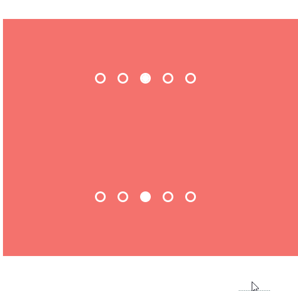

### 圆点分页器的样式集合
 
> * 参考：[tympanus.net-DotNavigationStyles](https://tympanus.net/Development/DotNavigationStyles/)

```scss
// style-1
.item:after {
   position: absolute; left: 0; right: 0; bottom: 0;
   border-radius: 50%; display: block;
   content: ' '; background-color: #fff;
   width: 100%; height: 0; transition: all 0.3s ease;
}
.item-checked:after {
   height: 100%;
}

// style-2
.list-item:after {
  height: 100% !important;
  background-color: transparent;
  box-shadow: inset 0px 0px 0px 3px #fff;
}
.list-item-checked:after {
  box-shadow: inset 0px 0px 0px 12px #fff;
}
```


