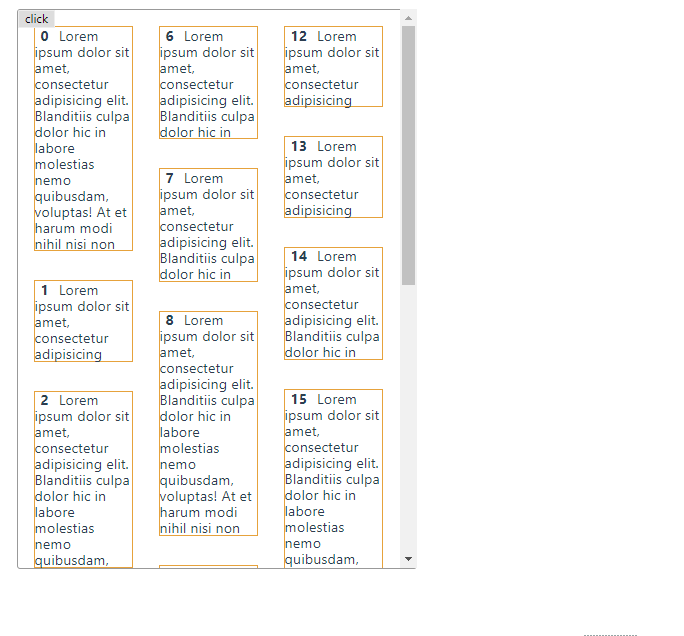

### 瀑布流布局

* 瀑布流在大部分的资讯、购物列表等地方都有应用，能起到激发读者阅读兴致的作用
* 瀑布流的实现的点有：自适应宽度、高度、错落有致、排版合理、能触发下拉事件并实现填补
* 瀑布流可以使用 `column-count` `flexbox` `javascript+absolute`等实现，查看下面的例子
* 并分析优缺点

##### `column-count` 实现布局

* `column-count/column-gap`
* 其中，`waterfall-item`的高度是不固定的（错落）

```html
<div class="waterfall-list">
  <div class="waterfall-item"></div>
</div>
```

```scss
.waterfall-list {
  column-count: 3;  // 重点
  column-gap: 2em;  // 重点
  &-2 {
    column-count: 4;
  }
  &-4 {
    column-count: 5;
  }
}

.waterfall-item {
  break-inside: avoid;
  span {
    font-weight: bold;
    padding: 0 8px;
  }
}
```


##### `flex-box` 布局


