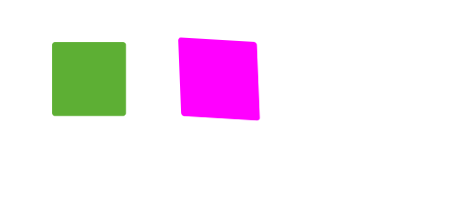

### Bounce.js

* **Bounce.js** is a Css3 plugin, which is, `Create beautiful CSS3 powered animations in no time`
* 其中，该框架的`bounce`即抖动行为是其精华所在
* [Github Bounce](Create beautiful CSS3 powered animations in no time)
* [Bounce.js Homepage](http://bouncejs.com/)
* Let's see how can we use it in vue

#### Install

```bash
* yarn add bounce.js
```

#### Some basic examples


#### How to get it

* `Bounce.js`提供了4个基础的动画动作，`scale, rotate, translate, skew`，以上的Gif是这基本4个动作的实现，基本代码如下：

```js
import Bounce from 'bounce.js'
const bounce1 = new Bounce()

bounce1.scale({
  from: { x: 0.5, y: 0.5 },
  to: { x: 1, y: 1 }
})
bounce1.applyTo(element/elements)

bounce2.rotate({ from: 0, to: 90 })

bounce3.translate({ from: { x: 0, y: 0 }, to: { x: 0, y: 50 } })

bounce4.skew({ from: { x: 0, y: 0 }, to: { x: 20, y: 0 } })
```

* 另外还有以下基本的配置：

```js
bounce.scale({
  duration: 1000, // 默认1000
  delay: 0,       // 默认0
  easing: 'bounce', // 默认bounce，可有的值有: "bounce", "sway", "hardbounce", "hardsway"
  bounces: 4,       // 弹跳，跳动，默认为4，值越多，抖动越厉害？
  stiffness: 3,     // 跟bounces配置相关，指跳动的“僵硬”程度，越大，“跳动”的自然效果越差？默认为3，范围1~5
})
```

#### 使用方法

* **bounce**的效果有两种方式使其生效：`define`和`applyTo`
* `define`

```js
var bounce = new Bounce();
bounce.rotate({
  from: 0,
  to: 90
});
bounce.define("my-animation");
```

* 然后在`css`中使用它

```scss
.css {
  animation: my-animation 1s linear both;
}
```

* `applyTo`

```js
bounce.applyTo(element/elements);
```

* 在使用`define`和`applyTo`方法时，还可以使用其他方法配置

```js
bounce.applyTo(element, {
  loop: false,      // default: false
  remove: false,    // 通常当你的元素的初使状态与你定义的 `to` 状态不一致，使用remove即可在动画结束后，恢复原来的状态
  onComplete: () => {}    // 函数，但通常你也可以使用 bounce.applyTo().then(() => {}) 来完成
})
```

#### 其他方法

* `bounce.remove()` 移除动画
* `Bounce.isSupported()` 检查浏览器是否支持


#### 其他优秀例子及代码



```js
  bounce11.scale({
    duration: 1000,
    from: { x: 1, y: 1 },
    to: { x: 2, y: 1 },
    stiffness: 1,
  }).scale({
    duration: 1000,
    from: { x: 1, y: 1 },
    to: { x: 1, y: 2 },
    bounce: 9,
    stiffness: 1,
  }).applyTo(this.$refs.eg11, {
  })

  bounce12.skew({
    from: { x: 0, y: 0},
    to: { x: 4, y: 6},
  })
    .scale({
      from: {x: 1, y: 1},
      to: {x: 2, y: 2},
    })
    .applyTo(this.$refs.eg12, {
    })
```