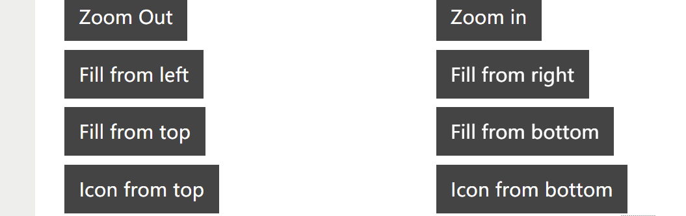
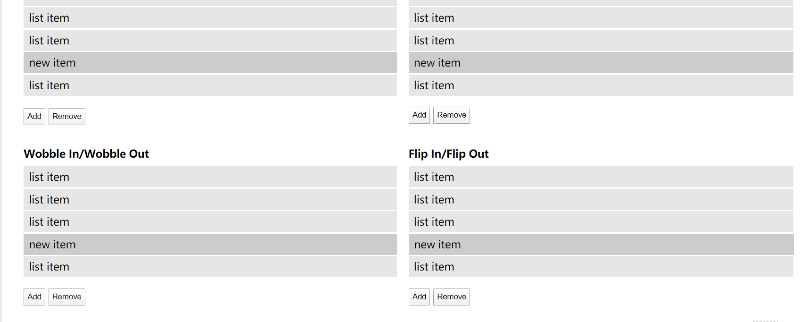
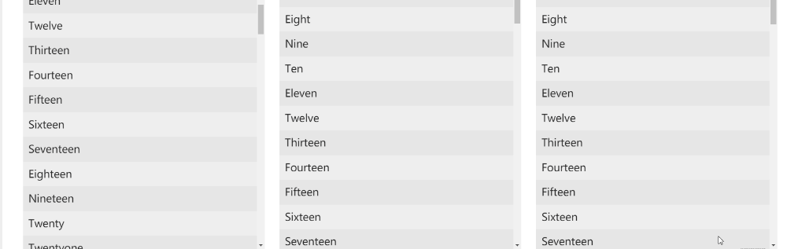
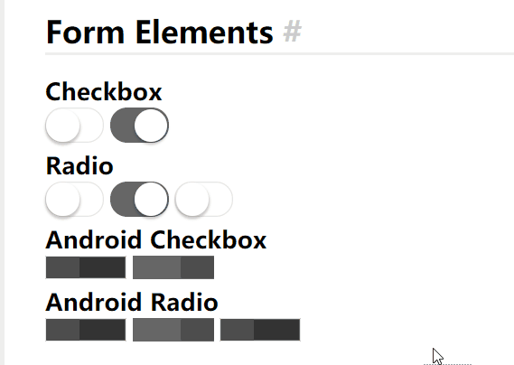

### Effeckt.css

* 这是一个 css 动画框架，都是一些，非常基本动画，然而内容众多，并且有多个洐生品
* [Github Effeckt](https://github.com/h5bp/Effeckt.css)
* [HomePage Effeckt](http://h5bp.github.io/Effeckt.css)
* [Some awesome Egs](https://tympanus.net/Development/ModalWindowEffects/)

### 举例

