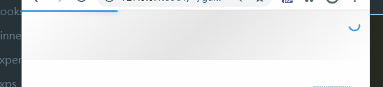

### NProgress.js 实现顶部激光进度条

* 实际上这玩意自己使用 `css3` 开发都不会很难，但是在开源的世界，一般我们会用别人提供的现成的插件
* [ricostacruz.com nprogress](http://ricostacruz.com/nprogress/)
* 一般来讲，可以在 `ajax` 的拦截器中部署 `NProgress`的调用，以全局使用
* `NProgress` 还提供了诸如`confirgure` `ease` 等函数方法，以方便定制使用

##### 使用

```bash
npm install --save nprogress
```

```js
NProgress.start()
NProgress.done()

//
NProgress.remove()

// 
NProgress.set(0)
NProgress.set(0.4)
NProgress.set(1.0)

// 
NProgress.inc(0.2)
NProgress.inc(0.4)
```



