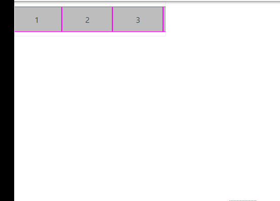
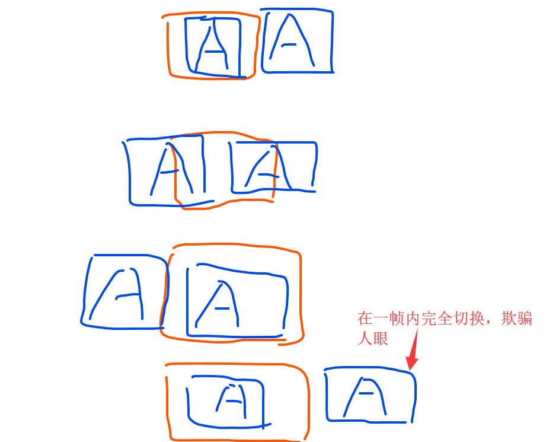
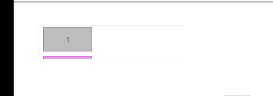

### 使用css3 animate 实现文字(图片)滚动

* 文字(图片)滚动在多个场景下都有业务实现，诸如像通知、新闻、广告滚动等等
* 以往jQ时代，往往是通过使用 jQ 动画实现，现在使用 css3 就能快速高效地实现
* 实际上这种方法是一种欺骗眼球的方法，它需要你的列表的宽刚好到你的设定宽度（如500px）
* 同时外部圈住列表的框也恰好是500px
* 同时，列表要复制两份，如AA，当一个A走完它的宽度，刚好显示完全后面的A，紧接着动画循环，在一帧内完成切换
* 使得人眼看起来就像在循环滚动一样，代码跟示例如下：
 
```scss
@-webkit-keyframes mymove {
  from {
    left:0px;
  }
  to {
    left:-500px;
  }
}

.css {
  animation:mymove 5s infinite linear;
}
```






* 这种提前设定宽度的动效应用范围比较窄，因为业务是多变的，比方说新闻文字是从后台读取的
* 或是广告图片是从后台读取的，宽度不定的，那这时只需要使用
* `transform: translateX(-50%)` 就能解决

```css
  @-webkit-keyframes move {
    from {
      transform: translateX(0);
    }
    to {
      transform: translateX(-50%);
    }
  }

```

* 通过思维发散，我们也可以实现向上滚动的动效(原理一致)
* 掌握好 `transform, animation`，就能实现大部分动效



