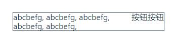
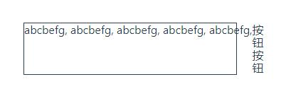
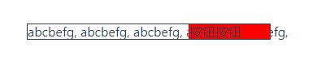
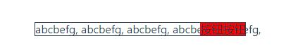

### flex: 0 0 auto 与 flex: 1; width: 0 的实例

* 出现这个标题是很让人困惑的，因为它展示了代码却没有表达出源由及最终结果，直接看图



* 这是一个简单的`flex`布局的样式，左边内容为`flex:1`，右边则为`width:auto`的按钮；
* 如果我们希望左边的`div`是不换行的，添加`white-space: nowrap`可以得到这样：



* 照成这样的情况是因为左边的`div`没有设置宽度，右边的也一样，导致`flex:1`的左边`div`权限过大，从而
* 引起了`flex-grow`的自动发生，这种情况，给右边的`button`添加一个有值的`width`，
* 同时给左边的`div`添加了个`width:0`可解决



* 但是更多的情况是，右边的按钮宽度不会是固定的，它有可能也是一个弹性大小的，所以设置`width:固定值`不可取
* 这时，应该设置左边`div`宽度为`width:0`，右边按钮为：`width:auto`即可解决



* 主要代码：

```scss
      .div1-1 {
        flex: 1;
        white-space: nowrap;
        width: 0;
      }
      .div1-2 {
        background-color: red;
        //width: auto;
        //flex: 0 0 auto;
      }
```


